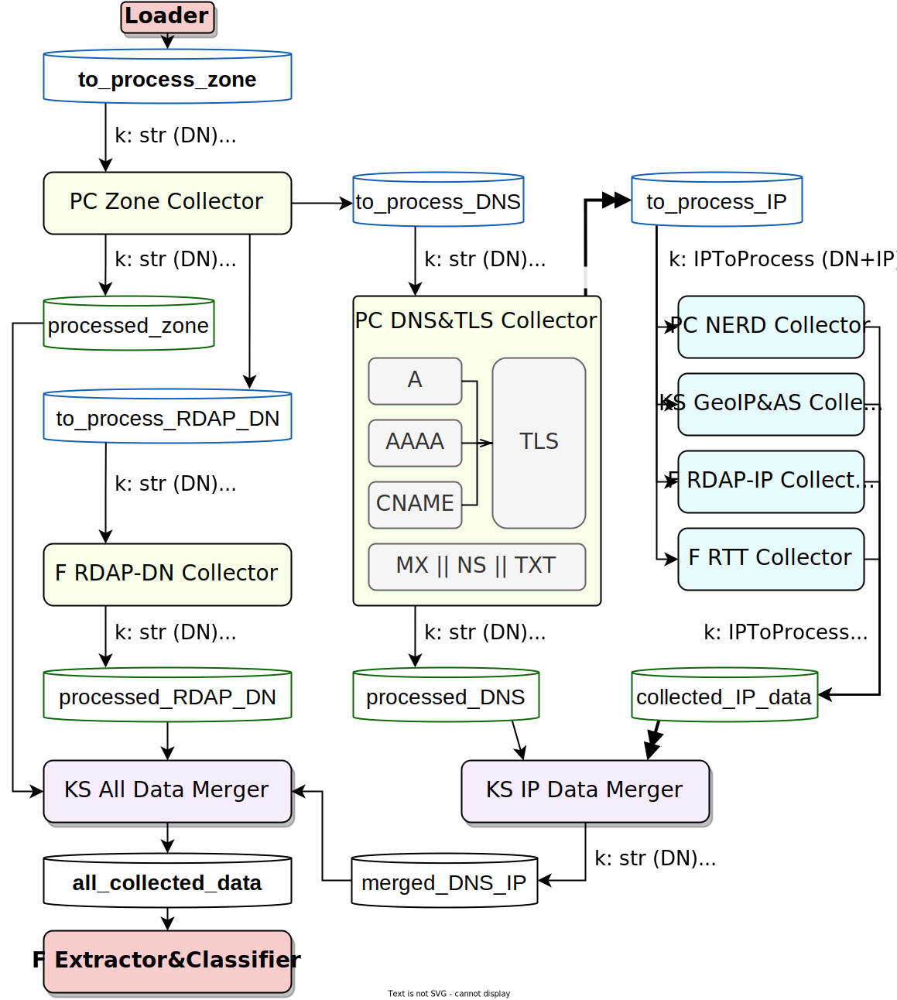

# Kafka pipeline & models

The main pipeline consists of several components that mostly accept a request from a topic, do a thing (e.g. collect some data) and publish the result to another topic (or to multiple topics). The picture below shows an overview diagram of the pipeline.

<div>
    
    <p>
        KS = Java / Kafka Streams; PC = Java / Parallel Consumer; F = Python / Faust.<br>DN = Domain Name; AS = Autonomous System; RTT = Round-Trip Time (ping).
    </p>
</div>

The green components collect data for a domain name, the blue components collect data for an IP address (though they are keyed with a DN/IP pair). The purple components perform a *gather* operation, merging together all the different results related to a domain name. The thin cylinders represent Kafka topics.

All the results in the intermediary *processed\_\** topics are exported (with varying granularity) to the PostgreSQL and MongoDB databases through Kafka Connect. See [this page](./kafka_connect.md) for more information.

## Models

In this document, the data structures are described using a syntax similar to Python dataclasses. However, in the actual pipeline, they are serialized as JSON (this will later be changed to a binary format with pre-defined schemas, probably Avro). The serialized values **must** contain all the specified fields. If `| None` is not present, the field **must** have a non-null value.

The base model for all events stored in the *processed\_\** topics is `Result`. Every component adds its own specific fields carrying the actual result data to this base structure.

```python
class Result:
    statusCode: int32
    error: str | None 
    lastAttempt: int64
```

The status codes with descriptions can be found [here](https://github.com/nesfit/domainradar-colext/blob/main/java_pipeline/common/src/main/java/cz/vut/fit/domainradar/models/ResultCodes.java). The value of 0 means success.\
The error field *may* contain a human-readable error message if the status code is not 0.\
The last attempt field contains a UNIX timestamp (in milliseconds) of when the operation was *finished*.

The base model for all IP collector results is `CommonIPResult of TData`.

```python
class CommonIPResult[TData](Result):
    collector: str
    data: TData | None  # null iff statusCode != 0
```

These results carry a string identifier of the collector that created them. The actual data is always stored in field called `data`.

## Zone collector

- Input topic: *to_process_zone*
    - Key: string – DN
    - Value: empty or `ZoneProcessRequest`
- Output topics:
    - *processed_zone*: zone data
        - Key: string – DN
        - Value: `ZoneResult`
    - *to_process_dns*: request for the [DNS collector](#dns--tls-collector)
    - *to_process_RDAP_DN*: request for the [RDAP-DN collector](#rdap-dn-collector)
- **TODO: Errors**

```python
class ZoneProcessRequest:
    collectDNS: bool
    collectRDAP: bool
    dnsTypesToCollect: list[str] | None
    dnsTypesToProcessIPsFrom: list[str] | None
```

The request body is optional. If present, it may contain two lists passed to the `DNSProcessRequest` (see below) if the zone is discovered. The two booleans control whether a DNS and an RDAP process requests will be sent to the respective *to_process* topics.

```python
class ZoneResult(Result):
    zone: ZoneInfo | None  # null iff statusCode != 0

class ZoneInfo:
    zone: str
    soa: SOARecord
    publicSuffix: str
    registrySuffix: str
    primaryNameserverIps: set[str] | None
    secondaryNameservers: set[str] | None
    secondaryNameserverIps: set[str] | None

class SOARecord:
    primaryNs: str
    respMailboxDname: str
    serial: str
    refresh: int64
    retry: int64
    expire: int64
    minTTL: int64
```

The primary/secondary NS IPs lists may be null if the corresponding DNS resolutions failed. See [this wiki page](https://github.com/google/guava/wiki/InternetDomainNameExplained) for an explanation of what public and registry suffixes mean.

## DNS & TLS collector

- Input topic: *to_process_dns*: request for the DNS collector
    - Key: string – DN
    - Value: `DNSProcessRequest`
- Output topics:
    - *processed_DNS*: DNS & TLS scan result
        - Key: string – DN
        - Value: `DNSResult`
    
    - *to_process_IP*: request for the IP collectors
        - Key: `IPToCollect` (a DN/IP pair)
        - Value: empty
- **TODO: Errors**

```python
class DNSProcessRequest:
    typesToCollect: list[str] | None
    typesToProcessIPsFrom: list[str] | None
    zoneInfo: ZoneInfo
```

TODO

## RDAP-DN collector

TODO

## NERD collector

TODO

## RDAP-IP collector

TODO

## GeoIP & Autonomous System collector

TODO

## RTT (ping) collector

TODO

## IP data merger

TODO

## All data merger

TODO